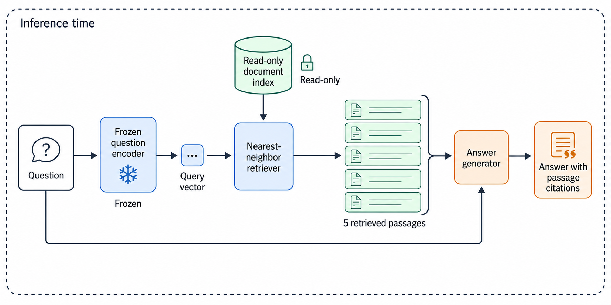

# PaperVizAgent for Codex

Scientific figures from paper text, using the Codex session you're already
signed into. No API keys, model configuration, MCP server, or GPU setup.

An independent adaptation of [Google Research's PaperVizAgent](https://github.com/google-research/papervizagent)
(formerly PaperBanana), packaged with [ToolFactory](https://github.com/GoatInAHat/toolfactory).
The planning, styling, and critique guidance is derived from the official
implementation. This project is not an official Google or OpenAI integration.

<!-- tf:install -->
## Install

[](https://skills.sh/GoatInAHat/PaperVizAgent-codex)

- **Agent Skill** — `npx skills add GoatInAHat/PaperVizAgent-codex`
- **Codex plugin** — `codex plugin marketplace add GoatInAHat/PaperVizAgent-codex`, then `codex plugin add papervizagent-codex@papervizagent-codex`

<!-- /tf:install -->

After installation, start a new Codex task and ask:

```text
Use $papervizagent-codex to turn this paper's methods section into a scientific
diagram. Use this caption: "Overview of our inference pipeline."
```

Attach your paper or paste the relevant text. A sketch or style reference is
optional. You can also request a revision of an existing figure, a native
editable SVG, or a plot from actual data.

## How it works

| Stage | Execution |
|---|---|
| Read and select references | Active Codex model; supplied references or bundled layout guidance |
| Plan | Explicit elements, connections, evidence, labels, and invariants |
| Style | Visual details added without changing scientific meaning |
| Render | Codex's built-in image-generation tool |
| Review and revise | Codex inspects the actual image, applies targeted edits, and keeps the best candidate |

The default is one candidate with up to two correction passes, stopping early
when no actionable defects remain. Ask for a smaller budget when you want only
a draft. Every figure comes with its specification, exact prompts, and a concise
visual review. Follow-up changes preserve the prior versions and scientific
invariants.

The plugin uses the current session's model for reasoning and visual review.
The host chooses the built-in image model. OpenAI currently documents that path
as GPT Image 2 using included Codex usage limits; image generation consumes
those limits faster than ordinary text turns. This plugin has no inference
client and never reads or forwards OAuth tokens.
[Codex image-generation documentation](https://learn.chatgpt.com/docs/image-generation)

## Requirements and outputs

- A signed-in Codex session with built-in image generation and visual inspection
  available. No separate model account or key is required.
- Installation is the only plugin setup. Node/Python development tooling belongs
  to the repository's build checks, not the installed image workflow.
- Figures are saved to your requested location or a new directory under
  `outputs/figures/`, subject to the host's workspace rules.
- If native image generation is unavailable, the skill preserves a specification
  and prompt and reports the limitation. It doesn't silently switch providers.

Raster figures remain raster figures. For an explicit editable request, Codex
authors native SVG elements and inspects the rendering; there is no promise of
lossless raster-to-vector conversion. Quantitative plots use executable code and
supplied data, with plotting source retained. Neither path needs another model.

## Example



Generated from the synthetic method below using native Codex image generation.
The [original](examples/retrieval/figure-v1.png),
[revision prompt](examples/retrieval/prompt-v2.md), and
[visual review](examples/retrieval/review.md) show a tested edit that retained the
scientific connections.

Try the fully specified [retrieval method](examples/method.md):

```text
Use $papervizagent-codex to illustrate examples/method.md. Keep the original
question flowing into the generator and mark the question encoder frozen.
```

The test source specifies the method completely, so the output can be checked
for missing connections and invented stages. See [behavioral evaluations](evals/README.md)
for test cases and recorded results.

## What is adapted

| Official PaperVizAgent | This Codex adaptation |
|---|---|
| Specialized agents making direct model API calls | Staged instructions executed by the active Codex session |
| Retrieved benchmark reference figures | Optional supplied references and authored layout heuristics; no benchmark download |
| Model-specific image client | Native Codex image tool, using the existing sign-in |
| Critic/refinement loop | Visual review, bounded targeted edits, and saved candidate history |
| Statistical plotting code | Data-grounded code or native SVG, with source retained |

The adaptation does not inherit the paper's benchmark results. Its changed
models and reference strategy need their own evaluation. Review scientific
content and the target venue's requirements before treating a figure as final.

## Development

The installed plugin is instructions and references. ToolFactory owns the
manifest, marketplace entry, skill metadata, and installation projections. The
workflow prose under `skills/papervizagent-codex/` is authored here.

The exact upstream source revision and file hashes are recorded in
[UPSTREAM.json](UPSTREAM.json). [NOTICE](NOTICE) describes attribution and
modifications. The repository is licensed under [Apache-2.0](LICENSE).

See [CONTRIBUTING.md](CONTRIBUTING.md) for regeneration and verification.
