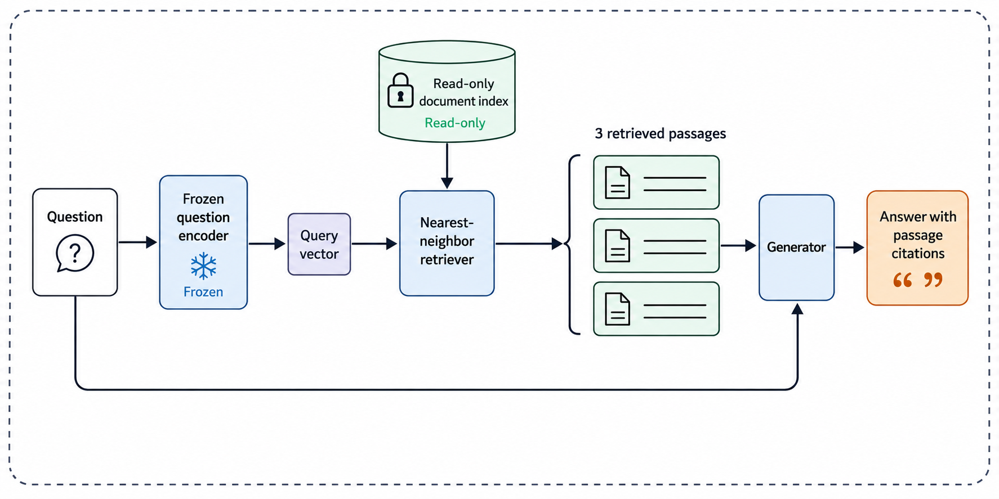

# Seeded independent critic correction

The [input image](../retrieval/figure-v1.png) shows five passages. This test's
[source](source.md), caption and description intentionally require three. A
fresh Critic received only those inputs, inspected the image, and returned a
[structured critique and complete revision](critic-0.json). A separate fresh
Visualizer generated a new image from the revised text, with no previous-image
reference or edit target.

The visible count and label are corrected. The full specification is still
partially unmet: the inference-time boundary label is missing and one connector
is routed differently. See the [review](visualizer-review.md),
[exact prompt](prompt-critic-0.md), and [execution record](run.json).

This test used one image call. It establishes observed independent critique
and description-based regeneration, not benchmark parity or a perfect figure.
